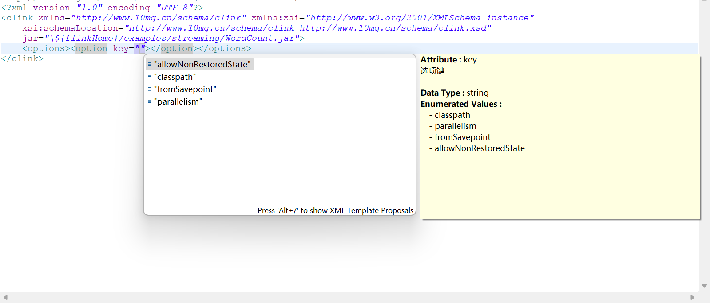

<p align="left">
    <a target="_blank" href="https://www.oracle.com/technetwork/java/javase/downloads/index.html">
        
    </a>
    <a target="_blank" href="LICENSE"></a>
    <a target="_blank" href='https://gitee.com/tenmg/clink'>
        
    </a>
    <a href="https://mvnrepository.com/search?q=clink&d=cn.tenmg">
        
    </a>
    <a target="_blank" href="https://jq.qq.com/?_wv=1027&k=wOOIp0CR">
        
    </a>
</p>

# 简介

Clink 为基于 Java 的 Flink 应用程序提供快速集成的能力，可通过 Clink 快速构建 Flink 流批一体应用程序，实现异构数据库实时同步和 ETL。Clink 提供了数据源管理模块，通过 Clink 运行 Flink SQL 会变得极其简单。使用 clink-clients 可以实现基于 Java API 启动 Clink 应用程序，还可以将 flink 任务实现通过 XML 配置文件来管理。一个典型的Clink部署架构如下：


当然，如果您选择仅使用[Flink CDC](https://github.com/ververica/flink-cdc-connectors)，那么以上的Debezium和Kafka就不需要了。总体而言，Clink是一个集成开发框架，它能够帮助用户更好地使用Flink及Flink的周边生态（包括但不限于[Flink CDC](https://github.com/ververica/flink-cdc-connectors)、[FlinkX](https://gitee.com/dtstack_dev_0/flinkx)），尤其是Flink SQL和[Flink CDC](https://github.com/ververica/flink-cdc-connectors)。

# Flink版本

Clink对Flink特定版本依赖较弱，已知在1.13+环境下运行良好，用户可根据需要自行选择Flink的发行版本。

# 开始使用

以Maven项目为例

1.  pom.xml添加依赖（Flink等其他相关依赖此处省略），${clink.version}为版本号，可定义属性或直接使用版本号替换

```
<!-- https://mvnrepository.com/artifact/cn.tenmg/clink-clients -->
<dependency>
    <groupId>cn.tenmg</groupId>
    <artifactId>clink-clients</artifactId>
    <version>${clink.version}</version>
</dependency>
<!-- https://mvnrepository.com/artifact/cn.tenmg/clink-core -->
<dependency>
    <groupId>cn.tenmg</groupId>
    <artifactId>clink-core</artifactId>
    <version>${clink.version}</version>
</dependency>
```

2.  配置文件clink.properties

clink.properties用于配置Clink应用运行的数据源以及其他特性等。

```
# REST 配置，用“，”分隔不同的地址使用“:”分隔地址和端口号，端口号可省略默认为8081
rest.addresses=192.168.100.11,192.168.100.12,192.168.100.13
# 或者也允许使用 rest.address
# rest.address=192.168.100.11,192.168.100.12,192.168.100.13
# 只重试一次（默认值为20），以避免某些节点挂了后重试时间过长
rest.retry.max-attempts=1

# Clink客户端提交执行的默认类名，它不是必需的，默认为 cn.tenmg.clink.ClinkPortal，也可以实现和配置自己的类或者在 jar 中指定主类
# clink.default.class=cn.tenmg.clink.ClinkPortal

#Flink Table API配置
#空值处理配置
table.exec.sink.not-null-enforcer=drop

#Clink数据同步类型转换配置（将BIGINT表示的时间减去8小时得到北京时间，并转为TIMESTAMP）
data.sync.columns.convert=BIGINT,TIMESTAMP:TO_TIMESTAMP(FROM_UNIXTIME(#columnName/1000 - 8*60*60, 'yyyy-MM-dd HH:mm:ss'))

#FlinkSQL数据源配置
#配置名称为kafka的数据源
datasource.kafka.connector=kafka
datasource.kafka.properties.bootstrap.servers=192.168.100.24:9092,192.168.100.25:9092,192.168.100.26:9092
datasource.kafka.properties.group.id=Clink
datasource.kafka.scan.startup.mode=earliest-offset
datasource.kafka.format=debezium-json
datasource.kafka.debezium-json.schema-include=false

#配置名称为bidb的数据源
datasource.bidb.connector=jdbc
datasource.bidb.driver=com.mysql.jdbc.Driver
datasource.bidb.url=jdbc:mysql://192.168.100.66:3306/bidb?useSSL=false&serverTimezone=GMT%2B8&zeroDateTimeBehavior=convertToNull
datasource.bidb.username=your_name
datasource.bidb.password=your_password

datasource.starrocks.jdbc-url=jdbc:mysql://192.168.10.140:9030
datasource.starrocks.load-url=192.168.10.140:8030
datasource.starrocks.connector=starrocks
datasource.starrocks.username=your_name
datasource.starrocks.password=your_password
datasource.starrocks.database-name=your_db
datasource.starrocks.sink.properties.column_separator=\\x01
datasource.starrocks.sink.properties.row_delimiter=\\x02
# the flushing time interval, range: [1000ms, 3600000ms].
datasource.starrocks.sink.buffer-flush.interval-ms=10000
# max retry times of the stream load request, range: [0, 10].
datasource.starrocks.sink.max-retries=3
```

3.  编写应用入口类（此步骤非必须，可直接使用`cn.tenmg.clink.ClinkPortal`）

```
public class ClinkPortal {

	/**
	 * 服务基础包名
	 */
	private static final String basePackage = "cn.tenmg.clink.quickstart.service";

	public static void main(String... args) throws Exception {
		ClinkRunner runner = new ClinkRunner() {

			@SuppressWarnings("unchecked")
			@Override
			protected StreamService getStreamService(String serviceName) {// 根据类名获取流服务实例
				StreamService streamService = null;
				try {
					Class<StreamService> streamServiceClass = (Class<StreamService>) Class
							.forName(basePackage + "." + serviceName);
					streamService = streamServiceClass.newInstance();
				} catch (ClassNotFoundException | InstantiationException | IllegalAccessException e) {
					e.printStackTrace();
				}
				return streamService;
			}

		};
		runner.run(args);
	}

}

```

4. 运行、监控、取消和停止应用

(1) 提交作业

调用XMLConfigLoader的load方法加载XML配置文件并提交给客户端执行：

```
Clink clink = XMLConfigLoader.getInstance().load(ClassUtils.getDefaultClassLoader().getResourceAsStream("clink.xml"));
StandaloneRestClusterClient client = new StandaloneRestClusterClient();
JobID jobId = client.submit(clink);
System.out.println("Flink job launched: " + jobId.toHexString());// 启动clink作业
```

或

```
Clink clink = XMLConfigLoader.getInstance()
	.load("<?xml version=\"1.0\" encoding=\"UTF-8\"?>\r\n" + 
		"<clink xmlns=\"http://www.10mg.cn/schema/clink\"\r\n" + 
		"	xmlns:xsi=\"http://www.w3.org/2001/XMLSchema-instance\"\r\n" + 
		"	xsi:schemaLocation=\"http://www.10mg.cn/schema/clink http://www.10mg.cn/schema/clink.xsd\"\r\n" + 
		"	jar=\"/opt/clink/clink-quickstart-1.1.4.jar\" serviceName=\"HelloWorldService\">\r\n" + 
       		"</clink>");
StandaloneRestClusterClient client = new StandaloneRestClusterClient();
JobID jobId = client.submit(clink);
System.out.println("Flink job launched: " + jobId.toHexString());// 启动clink作业
```

(2) 监控状态


```
JobID jobId = JobID.fromHexString(hexString);
JobStatus jobStatus = client.getJobStatus(jobId);// 获取作业状态
System.out.println("Job status: " + jobStatus);
```

(3) 高级功能

```
//ClusterClient clusterClient = client.getClusterClient(customConf);// 使用自定义配置获取ClusterClient
ClusterClient clusterClient = client.getClusterClient();
// Use clusterClient to do something
```

(4) 停止作业


```
System.out.println("Flink job of jobId: " + jobId.toHexString() + " stopped, savepoint path: " + client.stop(jobId));// 停止clink作业
	
```

# 配置手册

## XML

使用clink-clients可实现使用XML配置文件来管理Clink任务，这样开发Clink任务会显得非常简单；同时，用户自定义的Clink服务也可以被更轻松得集成到其他系统中。另外，XML文件具有良好的可读性，并且在IDE环境下能够对配置进行自动提示，方便用户更高效地完成任务的配置。

### `<clink>`

`<clink>`是Clink任务XML配置文件的根节点，需注意必须配置正确的命名空间，通常结构如下：

```
<clink xmlns="http://www.10mg.cn/schema/clink"
	xmlns:xsi="http://www.w3.org/2001/XMLSchema-instance"
	xsi:schemaLocation="http://www.10mg.cn/schema/clink http://www.10mg.cn/schema/clink.xsd">
</clink>
```

相关属性及说明：

属性        | 类型                | 必需 | 说明
------------|----------------------|----|--------
jar         | `String`             | 否 | 运行的JAR包。可通过配置文件的`clink.default.jar`配置指定默认运行的JAR包。
class       | `String`             | 否 | 运行的主类。可通过配置文件的`clink.default.class`配置指定默认运行的主类。
serviceName | `String`             | 否 | 运行的服务名称。该名称由用户定义并实现根据服务名称获取服务的方法，[Clink](https://gitee.com/tenmg/Clink)则在运行时调用并确定运行的实际服务。在运行SQL任务时，通常通过Clink内的其他标签（如`<execute-sql>`）指定操作，而无需指定serviceName。
runtimeMode | `String`             | 否 | 运行模式。可选值："BATCH"/"STREAMING"/"AUTOMATIC"，相关含义详见[Flink](https://flink.apache.org)官方文档。

#### `<configuration>`

Flink作业的个性化配置，可以使用“,”或者换行符分隔多个不同配置，例如`k1=v1[,k2=v3…]`。具体配置项需参考Flink官方文档，例如：`<configuration><![CDATA[pipeline.name=customJobName]]></configuration>`表示自定义Flink SQL作业的名称为`customJobName`。具体配置项详见[Flink官方文档](https://flink.apache.org/)。

#### `<options>`

运行选项配置，用于指定flink程序的运行选项。

##### `<option>`

特定运行选项配置。XSD文件提供了选项key值的枚举，能够在IDE环境下自动提示。



属性  | 类型     | 必需 | 说明
------|----------|----|--------
key   | `String` | 是 | 选项键。
value | `String` | 否 | 选项的值。使用标签内文本表示，如`<option>value</option>`或`<option><![CDATA[value]]></option>`。

#### `<params>`

参数查找表配置。通常可用于SQL中，也可以在[Clink](https://gitee.com/tenmg/Clink)应用程序自定义的服务中通过arguments参数获取。

##### `<param>`

特定参数配置。

属性  | 类型     | 必需 | 说明
------|----------|----|--------
name  | `String` | 是 | 参数名。
value | `String` | 否 | 参数值。使用标签内文本表示。

#### `<bsh>`

运行基于Beanshell的java代码的配置。

属性   | 类型     | 必需 | 说明
-------|----------|----|--------
saveAs | `String` | 否 | 操作结果另存为一个新的变量的名称。变量的值是基于Beanshell的java代码的返回值（通过`return xxx;`表示）。
when   | `String` | 否 | 操作的条件，当且仅当该条件满足时，才执行该操作。不指定时，默认表示条件成立。

##### `<var>`

基于Beanshell的java代码使用的变量声明配置。

属性   | 类型  | 必需 | 说明
------|--------|----|--------
name  | `String` | 是 | Beanshell中使用的变量名称
value | `String` | 否 | 变量对应的值的名称。默认与name相同。[Clink](https://gitee.com/tenmg/Clink)会从参数查找表中查找名称为value值的参数值，如果指定参数存在且不是null，则该值作为该参数的值；否则，使用value值作为该变量的值。

##### `<java>`

java代码。采用文本表示，如：`<java>java code</java>`或`<option><![CDATA[java code]]></option>`。注意：使用泛型时，不能使用尖括号声明泛型。例如，使用Map不能使用“Map<String , String> map = new HashMap<String , String>();”，但可以使用“Map map = new HashMap();”。

#### `<execute-sql>`

运行基于[DSL](https://gitee.com/tenmg/dsl)的SQL代码配置。

属性             | 类型     | 必需 | 说明
-----------------|----------|----|--------
saveAs           | `String` | 否 | 操作结果另存为一个新的变量的名称。变量的值是flink的`tableEnv.executeSql(statement);`的返回值。
when             | `String` | 否 | 操作的条件，当且仅当该条件满足时，才执行该操作。不指定时，默认表示条件成立。
dataSource       | `String` | 否 | 使用的数据源名称。这里的数据源是在[Clink](https://gitee.com/tenmg/Clink)应用程序的配置文件中配置，并非在clink-clients应用程序的配置文件中配置。详见[Clink数据源配置](https://gitee.com/tenmg/Clink#%E6%95%B0%E6%8D%AE%E6%BA%90%E9%85%8D%E7%BD%AE)。
dataSourceFilter | `String` | 否 | 使用的数据源过滤器。内置两种数据源过滤器（source/sink），如果内置过滤器无法满足使用要求，也可使用自定义类名（该类需实现`cn.tenmg.clink.datasource.DataSourceFilter`接口）。
catalog          | `String` | 否 | 执行SQL使用的Flink SQL的catalog名称。
script           | `String` | 否 | 基于[DSL](https://gitee.com/tenmg/dsl)的SQL脚本。使用标签内文本表示，如：`<execute-sql>SQL code</execute-sql>`或`<execute-sql><![CDATA[SQL code]]></execute-sql>`。由于Flink SQL不支持DELETE、UPDATE语句，因此如果配置的SQL脚本是DELETE或者UPDATE语句，该语句将在程序main函数中采用JDBC执行。

#### `<sql-query>`

运行基于[DSL](https://gitee.com/tenmg/dsl)的SQL查询代码配置。

属性       | 类型     | 必需 | 说明
-----------|----------|----|--------
saveAs     | `String` | 否 | 查询结果另存为临时表的表名及操作结果另存为一个新的变量的名称。变量的值是flink的`tableEnv.executeSql(statement);`的返回值。
when       | `String` | 否 | 操作的条件，当且仅当该条件满足时，才执行该操作。不指定时，默认表示条件成立。
catalog    | `String` | 否 | 执行SQL使用的Flink SQL的catalog名称。
script     | `String` | 否 | 基于[DSL](https://gitee.com/tenmg/dsl)的SQL脚本。使用标签内文本表示，如：`<sql-query>SQL code</sql-query>`或`<sql-query><![CDATA[SQL code]]></sql-query>`。

#### `<jdbc>`

运行基于[DSL](https://gitee.com/tenmg/dsl)的JDBC SQL代码配置。目标JDBC SQL代码是在[Clink](https://gitee.com/tenmg/Clink)应用程序的main函数中运行的。

属性       | 类型     | 必需 | 说明
-----------|----------|----|--------
saveAs     | `String` | 否 | 执行结果另存为一个新的变量的名称。变量的值是执行JDBC指定方法的返回值。
when       | `String` | 否 | 操作的条件，当且仅当该条件满足时，才执行该操作。不指定时，默认表示条件成立。
dataSource | `String` | 是 | 使用的数据源名称。这里的数据源是在Clink应用程序的配置文件中配置，并非在clink-clients应用程序的配置文件中配置。详见[Clink数据源配置](#%E6%95%B0%E6%8D%AE%E6%BA%90%E9%85%8D%E7%BD%AE)。
method     | `String` | 否 | 调用的JDBC方法，支持"get"/"select"/"execute"/"executeUpdate"/"executeLargeUpdate"，默认是"executeUpdate"。可在配置文件中使用`jdbc.default-method`配置项修改默认值。
script     | `String` | 是 | 基于[DSL](https://gitee.com/tenmg/dsl)的SQL脚本。使用标签内文本表示。

#### `<data-sync>`

运行基于Flink SQL的流式任务实现数据同步。相关属性及说明如下：

属性       | 类型      | 必需 | 说明
-----------|-----------|----|--------
saveAs     | `String`  | 否 | 执行结果另存为一个新的变量的名称。变量的值是执行`INSERT`语句返回的`org.apache.flink.table.api.TableResult`对象。一般不使用。
when       | `String`  | 否 | 操作的条件，当且仅当该条件满足时，才执行该操作。不指定时，默认表示条件成立。
from       | `String`  | 是 | 来源数据源名称。目前仅支持Kafka数据源。
topic      | `String`  | 否 | Kafka主题。也可在fromConfig中配置`topic=xxx`。
fromConfig | `String`  | 否 | 来源配置。例如：`properties.grouClink-jobs`。
to         | `String`  | 是 | 目标数据源名称，目前仅支持JDBC数据源。
toConfig   | `String`  | 是 | 目标配置。例如：`sink.buffer-flush.max-rows = 0`。
table      | `String`  | 是 | 同步数据表名。
primaryKey | `String`  | 否 | 主键，多个列名以“,”分隔。当开启智能模式时，会自动获取主键信息。
timestamp  | `String`  | 否 | 时间戳列名，多个列名使用“,”分隔。设置这个值后，创建源表和目标表时会添加这些列，并在数据同步时写入这些列。一般在Clink应用程序中使用配置文件统一指定，而不是每个同步任务单独指定。
smart      | `Boolean` | 否 | 是否开启智能模式。不设置时，根据全局配置确定是否开启智能模式，全局默认配置为`clink.smart=true`。
`<column>` | `Element` | 否 | 同步数据列。当开启智能模式时，会自动获取列信息。

##### `<column>`

属性     | 类型     | 必需 | 说明
---------|----------|----|--------
fromName | `String` | 是 | 来源列名。
fromType | `String` | 否 | 来源数据类型。如果缺省，则如果开启智能模式会自动获取目标数据类型作为来源数据类型，如果关闭智能模式则必填。
toName   | `String` | 否 | 目标列名。默认为来源列名。
toType   | `String` | 否 | 目标列数据类型。如果缺省，则如果开启智能模式会自动获取，如果关闭智能模式则默认为来源列数据类型。
strategy | `String` | 否 | 同步策略。可选值：both/from/to，both表示来源列和目标列均创建，from表示仅创建原来列，to表示仅创建目标列，默认为both。
script   | `String` | 否 | 自定义脚本。通常是需要进行函数转换时使用。使用标签内文本表示。

#### `<create-table>`

根据指定的配置信息自动生成Fink SQL并创建一张表。这比手动拼写Flink SQL要高效很多。相关属性及说明如下：

属性             | 类型     | 必需 | 说明
-----------------|----------|----|--------
saveAs           | `String` | 否 | 操作结果另存为一个新的变量的名称。变量的值是flink的`tableEnv.executeSql(statement);`的返回值。
when             | `String` | 否 | 操作的条件，当且仅当该条件满足时，才执行该操作。不指定时，默认表示条件成立。
dataSource       | `String` | 是 | 使用的数据源名称。Clink从该数据源读取元数据信息，并自动生成Flink SQL。
dataSourceFilter | `String` | 否 | 使用的数据源过滤器。内置两种数据源过滤器（source/sink），如果内置过滤器无法满足使用要求，也可使用自定义类名（该类需实现`cn.tenmg.clink.datasource.DataSourceFilter`接口）。
tableName        | `String` | 是 | 创建表的表名。即`CREATE TABLE table_name ...`中的`table_name`。
catalog          | `String` | 否 | 执行SQL使用的Flink SQL的catalog名称。
bindTableName    | `String` | 否 | 绑定的表名，即WITH子句的“table-name”，默认与tableName相同。
primaryKey       | `String` | 否 | 主键，多个列名以“,”分隔。当开启智能模式时，会自动获取主键信息。
smart            | `String` | 否 | 是否开启智能模式。不设置时，根据Clink应用程序的全局配置确定是否开启智能模式，Clink应用程序的全局默认配置为`clink.smart=true`。

##### `<column>`

列信息配置。开启智能模式时，一般不需要配置，Clink会自动生成列及对应的数据类型。但也可以单独指定某些列的数据类型，不使用自动识别的类型。

属性 | 类型     | 必需 | 说明
-----|----------|----|--------
name | `String` | 是 | 列名。
type | `String` | 是 | 数据类型。使用标签内文本表示。

### XML配置示例

为了更好的理解Clink的XML配置文件，以下提供几种常见场景的XML配置文件示例：

#### 普通Flink程序

```
<?xml version="1.0" encoding="UTF-8"?>
<clink xmlns="http://www.10mg.cn/schema/clink"
	xmlns:xsi="http://www.w3.org/2001/XMLSchema-instance"
	xsi:schemaLocation="http://www.10mg.cn/schema/clink http://www.10mg.cn/schema/clink.xsd"
	jar="D:\Programs\flink-1.8.3\examples\batch\WordCount.jar">
</clink>
```

#### 自定义服务

以下为一个自定义服务任务XML配置文件：

```
<?xml version="1.0" encoding="UTF-8"?>
<clink xmlns="http://www.10mg.cn/schema/clink"
	xmlns:xsi="http://www.w3.org/2001/XMLSchema-instance"
	xsi:schemaLocation="http://www.10mg.cn/schema/clink http://www.10mg.cn/schema/clink.xsd"
	jar="/yourPath/yourJar.jar" serviceName="yourServiceName">
</clink>
```

#### 批处理SQL

以下为一个简单订单量统计SQL批处理任务XML配置文件：

```
<?xml version="1.0" encoding="UTF-8"?>
<clink xmlns="http://www.10mg.cn/schema/clink"
	xmlns:xsi="http://www.w3.org/2001/XMLSchema-instance"
	xsi:schemaLocation="http://www.10mg.cn/schema/clink http://www.10mg.cn/schema/clink.xsd"
	jar="/yourPath/yourJar.jar">
	<!--任务运行参数，一些公共参数也可在调用Java API之前指定，例如系统时间等 -->
	<params>
		<param name="beginDate">2021-01-01</param>
		<param name="endDate">2021-07-01</param>
	</params>

	<!-- 使用名为hivedb的数据源创建名为hive的catalog -->
	<execute-sql dataSource="hivedb">
		<![CDATA[
			create catalog hive
		]]>
	</execute-sql>
	<!--加载hive模块 -->
	<execute-sql>
		<![CDATA[
			load module hive
		]]>
	</execute-sql>
	<!--使用hive,core模块 -->
	<execute-sql>
		<![CDATA[
			use modules hive,core
		]]>
	</execute-sql>
	<!-- 使用名为pgdb的数据源创建表order_stats_daily（如果源表名和建表语句指定的表名不一致，可以通过 WITH ('table-name' 
		= 'actrual_table_name') 来指定） -->
	<execute-sql dataSource="pgdb">
		<![CDATA[
			CREATE TABLE order_stats_daily (
			  stats_date DATE,
			  `count` BIGINT,
			  PRIMARY KEY (stats_date) NOT ENFORCED
			) WITH ('sink.buffer-flush.max-rows' = '0')
		]]>
	</execute-sql>
	<!-- 使用hive catalog查询，并将结果存为临时表tmp，tmp放在默认的default_catalog中 -->
	<sql-query saveAs="tmp" catalog="hive">
		<![CDATA[
			select cast(to_date(o.business_date) as date) stats_date, count(*) `count` from odc_order_info_par o where o.business_date >= :beginDate and o.business_date < :endDate group by cast(to_date(o.business_date) as date)
		]]>
	</sql-query>
	<!-- 删除原有数据order_stats_daily（FLINK SQL不支持DELETE，此处执行的是JDBC）-->
	<execute-sql dataSource="pgdb">
		<![CDATA[
			delete from order_stats_daily where stats_date >= :beginDate and stats_date < :endDate
		]]>
	</execute-sql>
	<!-- 数据插入。实际上Flink最终将执行Upsert语法 -->
	<execute-sql>
		<![CDATA[
			INSERT INTO order_stats_daily(stats_date,`count`) SELECT stats_date, `count` FROM tmp
		]]>
	</execute-sql>
</clink>
```

#### 流处理SQL

以下为通过Debezium实现异构数据库同步任务XML配置文件：

```
<?xml version="1.0" encoding="UTF-8"?>
<clink xmlns="http://www.10mg.cn/schema/clink"
	xmlns:xsi="http://www.w3.org/2001/XMLSchema-instance"
	xsi:schemaLocation="http://www.10mg.cn/schema/clink http://www.10mg.cn/schema/clink.xsd">
	<!-- Flink内创建SOURCE数据库 -->
	<!-- <execute-sql>
		<![CDATA[
		CREATE DATABASE SOURCE
		]]>
	</execute-sql> -->
	<!-- 使用SOURCE数据库执行Flink SQL -->
	<!-- <execute-sql>
		<![CDATA[
		USE SOURCE
		]]>
	</execute-sql> -->
	<!-- 上述两步操作是非必须的，只是为了Flink自动生成的作业名称更容易识别 -->
	<!-- 也可以使用 pipeline.name 直接指定作业名称 -->
	<!-- <configuration><![CDATA[pipeline.name=customJobName]]></configuration> -->
	<!-- 定义名为kafka数据源的订单明细表 -->
	<execute-sql dataSource="kafka">
		<![CDATA[
		CREATE TABLE KAFKA_ORDER_DETAIL (
		  DETAIL_ID STRING,
		  ORDER_ID STRING,
		  ITEM_ID STRING,
		  ITEM_CODE STRING,
		  ITEM_NAME STRING,
		  ITEM_TYPE STRING,
		  ITEM_SPEC STRING,
		  ITEM_UNIT STRING,
		  ITEM_PRICE DECIMAL(12, 2),
		  ITEM_QUANTITY DECIMAL(12, 2),
		  SALE_PRICE DECIMAL(12, 2),
		  SALE_AMOUNT DECIMAL(12, 2),
		  SALE_DISCOUNT DECIMAL(12, 2),
		  SALE_MODE STRING,
		  CURRENCY STRING,
		  SUPPLY_TYPE STRING,
		  SUPPLY_CODE STRING,
		  REMARKS STRING,
		  CREATE_BY STRING,
		  CREATE_TIME BIGINT,
		  UPDATE_BY STRING,
		  UPDATE_TIME BIGINT,
		  OIL_GUN STRING,
		  EVENT_TIME TIMESTAMP(3) METADATA FROM 'value.source.timestamp' VIRTUAL,
		  PRIMARY KEY (DETAIL_ID) NOT ENFORCED
		) WITH ('topic' = 'kaorder1.kaorder.order_detail', 'properties.group.id' = 'clink_source_order_detail')
		]]>
	</execute-sql>
	<!-- 定义名为source数据源的订单明细表 -->
	<execute-sql dataSource="source">
		<![CDATA[
		CREATE TABLE ORDER_DETAIL (
		  DETAIL_ID STRING,
		  ORDER_ID STRING,
		  ITEM_ID STRING,
		  ITEM_CODE STRING,
		  ITEM_NAME STRING,
		  ITEM_TYPE STRING,
		  ITEM_SPEC STRING,
		  ITEM_UNIT STRING,
		  ITEM_PRICE DECIMAL(12, 2),
		  ITEM_QUANTITY DECIMAL(12, 2),
		  SALE_PRICE DECIMAL(12, 2),
		  SALE_AMOUNT DECIMAL(12, 2),
		  SALE_DISCOUNT DECIMAL(12, 2),
		  SALE_MODE STRING,
		  CURRENCY STRING,
		  SUPPLY_TYPE STRING,
		  SUPPLY_CODE STRING,
		  REMARKS STRING,
		  CREATE_BY STRING,
		  CREATE_TIME TIMESTAMP(3),
		  UPDATE_BY STRING,
		  UPDATE_TIME TIMESTAMP(3),
		  OIL_GUN STRING,
		  EVENT_TIME TIMESTAMP(3),
		  PRIMARY KEY (DETAIL_ID) NOT ENFORCED
		)
		]]>
	</execute-sql>
	<!-- 将kafka订单明细数据插入到source数据库订单明细表中 -->
	<execute-sql>
		<![CDATA[
		INSERT INTO ORDER_DETAIL(
		  DETAIL_ID,
		  ORDER_ID,
		  ITEM_ID,
		  ITEM_CODE,
		  ITEM_NAME,
		  ITEM_TYPE,
		  ITEM_SPEC,
		  ITEM_UNIT,
		  ITEM_PRICE,
		  ITEM_QUANTITY,
		  SALE_PRICE,
		  SALE_AMOUNT,
		  SALE_DISCOUNT,
		  SALE_MODE,
		  CURRENCY,
		  SUPPLY_TYPE,
		  SUPPLY_CODE,
		  REMARKS,
		  CREATE_BY,
		  CREATE_TIME,
		  UPDATE_BY,
		  UPDATE_TIME,
		  OIL_GUN,
		  EVENT_TIME
		)
		SELECT
		  DETAIL_ID,
		  ORDER_ID,
		  ITEM_ID,
		  ITEM_CODE,
		  ITEM_NAME,
		  ITEM_TYPE,
		  ITEM_SPEC,
		  ITEM_UNIT,
		  ITEM_PRICE,
		  ITEM_QUANTITY,
		  SALE_PRICE,
		  SALE_AMOUNT,
		  SALE_DISCOUNT,
		  SALE_MODE,
		  CURRENCY,
		  SUPPLY_TYPE,
		  SUPPLY_CODE,
		  REMARKS,
		  CREATE_BY,
		  TO_TIMESTAMP(FROM_UNIXTIME(CREATE_TIME/1000, 'yyyy-MM-dd HH:mm:ss')) CREATE_TIME,
		  UPDATE_BY,
		  TO_TIMESTAMP(FROM_UNIXTIME(CREATE_TIME/1000, 'yyyy-MM-dd HH:mm:ss')) UPDATE_TIME,
		  OIL_GUN,
		  EVENT_TIME
		FROM KAFKA_ORDER_DETAIL
		]]>
	</execute-sql>
</clink>
```

#### 数据同步

##### Kafka

以下为通过Debezium实现异构数据库同步任务XML配置文件：

```
<?xml version="1.0" encoding="UTF-8"?>
<clink xmlns="http://www.10mg.cn/schema/clink"
	xmlns:xsi="http://www.w3.org/2001/XMLSchema-instance"
	xsi:schemaLocation="http://www.10mg.cn/schema/clink http://www.10mg.cn/schema/clink-1.1.2.xsd">
	<data-sync table="od_order_info" to="data_skyline"
		from="kafka" topic="testdb.testdb.od_order_info">
		<!-- 在数据源和目标库表结构相同（字段名及类型均相同）的情况下，智能模式可自动从目标库获取表元数据信息，只要少量配就能完成数据同步。 -->
		<!-- 在数据源和目标库表结构不同（字段名或类型不同）的情况，需要自定义列的差异信息，例如自定来源类型和转换函数： -->
		<column fromName="UPDATE_TIME" fromType="BIGINT">TO_TIMESTAMP(FROM_UNIXTIME(UPDATE_TIME/1000, 'yyyy-MM-dd HH:mm:ss'))</column>
		<!-- 另外，如果关闭智能模式，需要列出所有列的详细信息。 -->
	</data-sync>
</clink>
```

##### Flink CDC 单表数据同步

```
<?xml version="1.0" encoding="UTF-8"?>
<clink xmlns="http://www.10mg.cn/schema/clink"
	xmlns:xsi="http://www.w3.org/2001/XMLSchema-instance"
	xsi:schemaLocation="http://www.10mg.cn/schema/clink http://www.10mg.cn/schema/clink.xsd">
	<data-sync from="test-cdc" to="test" table="test_table">
		<!-- 推荐指定 server-id -->
		<from-config><![CDATA['server-id'='5400']]></from-config>
	</data-sync>
</clink>
```

##### Flink CDC 多表数据同步

目前已支持多表同步的源连接器有：

| 产品            | 适配版本 | 支持版本 |
|---------------|------|--------|
| mysql-cdc     | 2.2+ | 1.6+   |
| sqlserver-cdc | 2.4+ | 1.6+   |
| postgres-cdc  | 2.4+ | 1.6.1+ |
| oracle-cdc    | 2.3+ | 1.6.1+ |

以下示例参考 clink.proerties 配置文件见 [clink-tests](clink-tests/src/test/resources/clink.proerties)，参考数据库表结构（以MySQL为例）：

```
create database test;
use test;
CREATE TABLE `test_table1` (
  `id` int NOT NULL,
  `name` varchar(255),
  `create_time` datetime,
  `update_time` timestamp DEFAULT CURRENT_TIMESTAMP,
  PRIMARY KEY (`id`)
);
CREATE TABLE `test_table2` (
  `id` int NOT NULL,
  `name` varchar(255),
  `create_time` datetime,
  `update_time` timestamp DEFAULT CURRENT_TIMESTAMP,
  PRIMARY KEY (`id`)
);

create database test1;
use test1;
CREATE TABLE `test_table1` (
  `id` int NOT NULL,
  `name` varchar(255),
  `create_time` datetime,
  `update_time` timestamp DEFAULT CURRENT_TIMESTAMP,
  PRIMARY KEY (`id`)
);

create database test2;
use test2;
CREATE TABLE `test_table2` (
  `id` int NOT NULL,
  `name` varchar(255),
  `create_time` datetime,
  `update_time` timestamp DEFAULT CURRENT_TIMESTAMP,
  PRIMARY KEY (`id`)
);

```

##### mysql-cdc

- 单一数据库

```
<?xml version="1.0" encoding="UTF-8"?>
<clink xmlns="http://www.10mg.cn/schema/clink"
	xmlns:xsi="http://www.w3.org/2001/XMLSchema-instance"
	xsi:schemaLocation="http://www.10mg.cn/schema/clink http://www.10mg.cn/schema/clink.xsd">
	<!-- 仅同步单一数据库多张表时，可简化表名配置 -->
	<data-sync from="mysql-cdc" to="postgresql-jdbc"
		table="test_table1,test_table2">
		<!-- 推荐指定 server-id -->
		<from-config><![CDATA['server-id'='5401']]></from-config>
		<!-- 如果在 MySQL 源表中存在类型为 TIMESTAMP 的列，则可能需要将该列的来源数据类型配置为 TIMESTAMP_LTZ 以避免时区不同导致时间差异，这与服务器时区也有直接的关系。 -->
		<column fromName="test_table1.update_time" fromType="TIMESTAMP_LTZ" />
		<column fromName="test_table2.update_time" fromType="TIMESTAMP_LTZ" />
	</data-sync>
</clink>
```

- 多个数据库

```
<?xml version="1.0" encoding="UTF-8"?>
<clink xmlns="http://www.10mg.cn/schema/clink"
	xmlns:xsi="http://www.w3.org/2001/XMLSchema-instance"
	xsi:schemaLocation="http://www.10mg.cn/schema/clink http://www.10mg.cn/schema/clink.xsd">
	<!-- 同步多个数据库时，需指明表对应的数据库 -->
	<data-sync from="mysql-cdc" to="test-sink"
		table="test1.test_table1,test2.test_table2">
<!-- 推荐指定 server-id -->
<!-- 目前一些数仓对删除支持不是很好（比如StarRocks的更新模型），增加指定 convert-delete-to-update 为 true 是指将删除记录转化为更新记录，这时通常会同时记录操作类型 OP。OP 是元数据，需在同步的表中添加 OP 列（列名可根据需要更改，与配置对应即可），并添加如下配置：

# 数据同步自动添加的列
data.sync.auto-columns=OP
# 来源列的类型，定义取元数据的方式
data.sync.OP.from-type=CHAR(1) METADATA FROM 'op' VIRTUAL

-->
		<from-config><![CDATA['server-id'='5401','convert-delete-to-update'='true']]></from-config>
                <!-- 如果在 MySQL 源表中存在类型为 TIMESTAMP 的列，则可能需要将该列的来源数据类型配置为 TIMESTAMP_LTZ 以避免时区不同导致时间差异，这与服务器时区也有直接的关系。 -->
                <column fromName="test1.test_table1.UPDATE_TIME" fromType="TIMESTAMP_LTZ"/>
                <!-- 当然，同样的问题也可以通过转换函数的方式来解决 -->
                <column fromName="test2.test_table2.UPDATE_TIME">TIMESTAMPADD(HOUR, -8, UPDATE_TIME)</column>
	</data-sync>
</clink>
```

##### sqlserver-cdc

- 单一数据库

```
<?xml version="1.0" encoding="UTF-8"?>
<clink xmlns="http://www.10mg.cn/schema/clink"
	xmlns:xsi="http://www.w3.org/2001/XMLSchema-instance"
	xsi:schemaLocation="http://www.10mg.cn/schema/clink http://www.10mg.cn/schema/clink.xsd">
	<!-- 仅同步单一数据库多张表时，可简化表名配置 -->
	<data-sync from="sqlserver-cdc" to="mysql-jdbc"
		table="test_table1,test_table2">
		<!-- 如果两张表分别属于不同所有者，则可通过table-name参数指定（不指定则默认为dbo） -->
		<!-- <from-config><![CDATA['table-name'='dbo.test_table1,admin.test_table2']]></from-config> -->
	</data-sync>
</clink>
```

- 多个数据库

```
<?xml version="1.0" encoding="UTF-8"?>
<clink xmlns="http://www.10mg.cn/schema/clink"
	xmlns:xsi="http://www.w3.org/2001/XMLSchema-instance"
	xsi:schemaLocation="http://www.10mg.cn/schema/clink http://www.10mg.cn/schema/clink.xsd">
	<data-sync from="sqlserver-cdc" to="test-sink"
		table="test1.test_table1,test2.test_table2">
<!-- 目前一些数仓对删除支持不是很好（比如StarRocks的更新模型），增加指定 convert-delete-to-update 为 true 是指将删除记录转化为更新记录，这时通常会同时记录操作类型 OP。OP 是元数据，需在同步的表中添加 OP 列（列名可根据需要更改，与配置对应即可），并添加如下配置：

# 数据同步自动添加的列
data.sync.auto-columns=OP
# 来源列的类型，定义取元数据的方式
data.sync.OP.from-type=CHAR(1) METADATA FROM 'op' VIRTUAL

-->
		<from-config><![CDATA['convert-delete-to-update'='true']]></from-config>
	</data-sync>
</clink>
```

##### postgres-cdc

- 单一 public 模式

```
<?xml version="1.0" encoding="UTF-8"?>
<clink xmlns="http://www.10mg.cn/schema/clink"
	xmlns:xsi="http://www.w3.org/2001/XMLSchema-instance"
	xsi:schemaLocation="http://www.10mg.cn/schema/clink http://www.10mg.cn/schema/clink.xsd">
	<data-sync from="postgresql-cdc" to="sqlserver-jdbc"
		table="test_table1,test_table2">
	</data-sync>
</clink>
```

- 多个模式

```
<?xml version="1.0" encoding="UTF-8"?>
<clink xmlns="http://www.10mg.cn/schema/clink"
	xmlns:xsi="http://www.w3.org/2001/XMLSchema-instance"
	xsi:schemaLocation="http://www.10mg.cn/schema/clink http://www.10mg.cn/schema/clink.xsd">
	<data-sync from="postgresql-cdc" to="sqlserver-jdbc"
		table="test_table1,test_table2">
		<!-- 两张表分别属于不同模式，则可通过table-name参数指定（不指定则默认为所有已配置的模式） -->
		<from-config><![CDATA['table-name'='public.test_table1,admin.test_table2']]></from-config>
	</data-sync>
</clink>
```

##### oracle-cdc

- 单一模式

```
<?xml version="1.0" encoding="UTF-8"?>
<clink xmlns="http://www.10mg.cn/schema/clink"
	xmlns:xsi="http://www.w3.org/2001/XMLSchema-instance"
	xsi:schemaLocation="http://www.10mg.cn/schema/clink http://www.10mg.cn/schema/clink.xsd">
	<data-sync from="oracle-cdc" to="mysql-jdbc"
		table="TEST_TABLE1,TEST_TABLE2">
	</data-sync>
</clink>
```
- 多个模式

```
<?xml version="1.0" encoding="UTF-8"?>
<clink xmlns="http://www.10mg.cn/schema/clink"
	xmlns:xsi="http://www.w3.org/2001/XMLSchema-instance"
	xsi:schemaLocation="http://www.10mg.cn/schema/clink http://www.10mg.cn/schema/clink.xsd">
	<data-sync from="oracle-cdc" to="mysql-jdbc"
		table="TEST_TABLE1,TEST_TABLE2">
		<!-- 两张表分别属于不同模式，则可通过table-name参数指定（不指定则默认为所有已配置的模式） -->
		<from-config><![CDATA['table-name'='C##TEST1.TEST_TABLE1,C##TEST2.TEST_TABLE2']]></from-config>
	</data-sync>
</clink>
```

## JSON

如果仅使用clink-core创建Clink应用程序，运行参数需通过JSON格式的字符串（注意，如果是命令行运行，JSON格式字符串前后需加上双引号或单引号，JSON格式字符串内部的双引号或单引号则需要转义）或者一个.json文件提供，结构如下：

```
{
    "serviceName": "specifyName",
    "runtimeMode": "BATCH"/"STREAMING"/"AUTOMATIC",
    "params": {
    	"key1": "value1",
    	"key2": "value2",
        …
    },
    "operates": [{
        "script": "specifySQL",
        "type": "ExecuteSql"
    }, {
        "dataSource": "kafka",
        "script": "specifySQL",
        "type": "ExecuteSql"
    }, {
        "saveAs": "specifyTemporaryTableName",
        "catalog": "specifyCatalog",
        "script": "specifySQL",
        "type": "SqlQuery"
   }, … ]
}
```

属性          | 类型                | 必需 | 说明
--------------|--------------------|----|--------
serviceName   | `String`             | 否 | 运行的服务名称。该名称由用户定义并实现根据服务名称获取服务的方法，Clink则在运行时调用并确定运行的实际服务。在运行SQL任务时，通常指定operates，而无需指定serviceName。
runtimeMode   | `String`             | 否 | 运行模式。可选值："BATCH"/"STREAMING"/"AUTOMATIC"，相关含义详见[Flink](https://flink.apache.org)官方文档。
configuration | `String`             | 否 | Flink作业的个性化配置，格式为`k1=v1[,k2=v3…]`。例如：`pipeline.name=customJobName`表示自定义Flink SQL作业的名称为`customJobName`。具体配置项详见[Flink](https://flink.apache.org)官方文档。
params        | `Map<String,Object>` | 否 | 参数查找表。通常可用于SQL中，也可以在自定义服务中通过arguments参数获取。
operates      | `List<Operate>`      | 否 | 操作列表。目前支持[Bsh](#bsh)、[ExecuteSql](#executesql)、[SqlQuery](#sqlquery)，[Jdbc](#jdbc)、[DataSync](https://gitee.com/tenmg/Clink#datasync)和[CreateTable](https://gitee.com/tenmg/Clink#createtable) 6种类型操作。

### Bsh

Bsh操作的作用是运行基于Beanshell的java代码。相关属性及说明如下：

属性   | 类型        | 必需 | 说明
-------|-------------|----|--------
type   | `String`    | 是 | 操作类型。这里是"Bsh"。
saveAs | `String`    | 否 | 操作结果另存为一个新的变量的名称。变量的值是基于Beanshell的java代码的返回值（通过`return xxx;`表示）。
when   | `String`    | 否 | 操作的条件，当且仅当该条件满足时，才执行该操作。不指定时，默认表示条件成立。
vars   | `List<Var>` | 否 | 参数声明列表。
java   | `String`    | 是 | java代码。注意：使用泛型时，不能使用尖括号声明泛型。例如，使用Map不能使用“Map<String , String> map = new HashMap<String , String>();”，但可以使用“Map map = new HashMap();”。

#### Var

属性   | 类型    | 必需 | 说明
------|----------|----|--------
name  | `String` | 是 | Beanshell中使用的变量名称
value | `String` | 否 | 变量对应的值的名称。默认与name相同。Clink会从参数查找表中查找名称为value值的参数值，如果指定参数存在且不是null，则该值作为该参数的值；否则，使用value值作为该变量的值。

### ExecuteSql

ExecuteSql操作的作用是运行基于[DSL](https://gitee.com/tenmg/dsl)的SQL代码。相关属性及说明如下：

属性             | 类型     | 必需 | 说明
-----------------|----------|----|--------
type             | `String` | 是 | 操作类型。这里是"ExecuteSql"。
saveAs           | `String` | 否 | 操作结果另存为一个新的变量的名称。变量的值是flink的`tableEnv.executeSql(statement);`的返回值。
when             | `String` | 否 | 操作的条件，当且仅当该条件满足时，才执行该操作。不指定时，默认表示条件成立。
dataSource       | `String` | 否 | 使用的数据源名称。
dataSourceFilter | `String` | 否 | 使用的数据源过滤器。内置两种数据源过滤器（source/sink），如果内置过滤器无法满足使用要求，也可使用自定义类名（该类需实现`cn.tenmg.clink.datasource.DataSourceFilter`接口）。
catalog          | `String` | 否 | 执行SQL使用的Flink SQL的catalog名称。
script           | `String` | 是 | 基于[DSL](https://gitee.com/tenmg/dsl)的SQL脚本。由于Flink SQL不支持DELETE、UPDATE语句，因此如果配置的SQL脚本是DELETE或者UPDATE语句，该语句将在程序main函数中采用JDBC执行。

### SqlQuery

SqlQuery操作的作用是运行基于[DSL](https://gitee.com/tenmg/dsl)的SQL查询代码。相关属性及说明如下：

属性       | 类型  | 必需 | 说明
-----------|----------|----|--------
saveAs     | `String` | 否 | 查询结果另存为临时表的表名及操作结果另存为一个新的变量的名称。变量的值是flink的`tableEnv.executeSql(statement);`的返回值。
when       | `String` | 否 | 操作的条件，当且仅当该条件满足时，才执行该操作。不指定时，默认表示条件成立。
catalog    | `String` | 否 | 执行SQL使用的Flink SQL的catalog名称。
script     | `String` | 是 | 基于[DSL](https://gitee.com/tenmg/dsl)的SQL脚本。

### Jdbc

Jdbc操作的作用是运行基于[DSL](https://gitee.com/tenmg/dsl)的JDBC SQL代码。相关属性及说明如下：

属性       | 类型     | 必需 | 说明
-----------|----------|----|--------
type       | `String` | 是 | 操作类型。这里是"Jdbc"。
saveAs     | `String` | 否 | 执行结果另存为一个新的变量的名称。变量的值是执行JDBC指定方法的返回值。
when       | `String` | 否 | 操作的条件，当且仅当该条件满足时，才执行该操作。不指定时，默认表示条件成立。
dataSource | `String` | 是 | 使用的数据源名称。
method     | `String` | 否 | 调用的JDBC方法，支持"get"/"select"/"execute"/"executeUpdate"/"executeLargeUpdate"，默认是"executeUpdate"。可在配置文件中使用`jdbc.default_method`配置项修改默认值。
script     | `String` | 是 | 基于[DSL](https://gitee.com/tenmg/dsl)的SQL脚本。

目标JDBC SQL代码是在Clink应用程序的main函数中运行的。

### DataSync

DataSync操作的作用是运行基于Flink SQL的流式任务实现数据同步，其原理是根据配置信息自动生成并执行Flink SQL。相关属性及说明如下：

属性       | 类型            | 必需 | 说明
-----------|----------------|----|--------
type       | `String`       | 是 | 操作类型。这里是"DataSync"。
saveAs     | `String`       | 否 | 执行结果另存为一个新的变量的名称。变量的值是执行`INSERT`语句返回的`org.apache.flink.table.api.TableResult`对象。
when       | `String`       | 否 | 操作的条件，当且仅当该条件满足时，才执行该操作。不指定时，默认表示条件成立。
from       | `String`       | 是 | 来源数据源名称。目前仅支持Kafka数据源。
topic      | `String`       | 否 | Kafka主题。也可在fromConfig中配置`topic=xxx`。
fromConfig | `String`       | 否 | 来源配置。例如：`properties.group.id=Clink`。
to         | `String`       | 是 | 目标数据源名称，目前仅支持JDBC数据源。
toConfig   | `String`       | 是 | 目标配置。例如：`sink.buffer-flush.max-rows = 0`。
table      | `String`       | 是 | 同步数据表名。
columns    | `List<Column>` | 否 | 同步数据列。当开启智能模式时，会自动获取列信息。
primaryKey | `String`       | 否 | 主键，多个列名以“,”分隔。当开启智能模式时，会自动获取主键信息。
timestamp  | `String`       | 否 | 时间戳列名，多个列名使用“,”分隔。设置这个值后，创建源表和目标表时会添加这些列，并在数据同步时写入这些列。一般使用配置文件统一指定，而不是每个同步任务单独指定。
smart      | `Boolean`      | 否 | 是否开启智能模式。不设置时，根据全局配置确定是否开启智能模式，全局默认配置为`clink.smart=true`。


#### column

属性     | 类型     | 必需 | 说明
---------|----------|----|--------
fromName | `String` | 是 | 来源列名。
fromType | `String` | 否 | 来源数据类型。如果缺省，则如果开启智能模式会自动获取目标数据类型作为来源数据类型，如果关闭智能模式则必填。
toName   | `String` | 否 | 目标列名。默认为来源列名。
toType   | `String` | 否 | 目标列数据类型。如果缺省，则如果开启智能模式会自动获取，如果关闭智能模式则默认为来源列数据类型。
strategy | `String` | 否 | 同步策略。可选值：both/from/to，both表示来源列和目标列均创建，from表示仅创建原来列，to表示仅创建目标列，默认为both。
script   | `String` | 否 | 自定义脚本。通常是需要进行函数转换时使用。

#### 相关配置

可以增加数据同步的相关配置，详见配置文件的[数据同步配置](#%E6%95%B0%E6%8D%AE%E5%90%8C%E6%AD%A5%E9%85%8D%E7%BD%AE)。

### CreateTable

CreateTable操作的作用根据指定的配置信息自动生成Fink SQL并创建一张表。这比手动拼写Flink SQL要高效很多。相关属性及说明如下：

属性             | 类型     | 必需 | 说明
-----------------|----------|----|--------
type             | `String` | 是 | 操作类型。这里是"CreateTable"。
saveAs           | `String` | 否 | 操作结果另存为一个新的变量的名称。变量的值是flink的`tableEnv.executeSql(statement);`的返回值。
when             | `String` | 否 | 操作的条件，当且仅当该条件满足时，才执行该操作。不指定时，默认表示条件成立。
dataSource       | `String` | 是 | 使用的数据源名称。Clink从该数据源读取元数据信息，并自动生成Flink SQL。
dataSourceFilter | `String` | 否 | 使用的数据源过滤器。内置两种数据源过滤器（source/sink），如果内置过滤器无法满足使用要求，也可使用自定义类名（该类需实现`cn.tenmg.clink.datasource.DataSourceFilter`接口）。
tableName        | `String` | 是 | 创建表的表名。即`CREATE TABLE table_name ...`中的`table_name`。
catalog          | `String` | 否 | 执行SQL使用的Flink SQL的catalog名称。
bindTableName    | `String` | 否 | 绑定的表名，即WITH子句的“table-name”，默认与tableName相同。
primaryKey       | `String` | 否 | 主键，多个列名以“,”分隔。当开启智能模式时，会自动获取主键信息。
smart            | `String` | 否 | 是否开启智能模式。不设置时，根据Clink应用程序的全局配置确定是否开启智能模式，Clink应用程序的全局默认配置为`clink.smart=true`。

##### Column

列信息配置。开启智能模式时，一般不需要配置，Clink会自动生成列及对应的数据类型。但也可以单独指定某些列的数据类型，不使用自动识别的类型。

属性 | 类型     | 必需 | 说明
-----|----------|----|--------
name | `String` | 是 | 列名。
type | `String` | 是 | 数据类型。


# 配置文件

默认的配置文件为clink.properties（注意：需在classpath下），可通过clink-context-loader.properties配置文件的`config.location`修改配置文件路径和名称。配置项的值允许通过占位符`${}`引用，例如`key=${anotherKey}`。

## 数据源配置

### 普通数据源

每个数据源有一个唯一的命名，普通数据源配置以“datasource”为前缀，以“.”作为分隔符，格式为`datasource.${name}.${key}=${value}`。其中，第一和第二个“.”符号之间的是数据源名称，第二个“.”符号之后和“=”之前的是该数据源具体的配置项，“=”之后的是该配置项的值。数据源的配置项与[Flink](https://flink.apache.org)保持一致，具体配置项详见[Flink官方文档](https://flink.apache.org)。以下给出部分常用数据源配置示例：

```
#FlinkSQL数据源配置
#Debezium
#配置名称为kafka的数据源
datasource.kafka.connector=kafka
datasource.kafka.properties.bootstrap.servers=192.168.1.101:9092,192.168.1.102:9092,192.168.1.103:9092
datasource.kafka.properties.group.id=Clink
datasource.kafka.scan.startup.mode=earliest-offset
datasource.kafka.format=debezium-json
datasource.kafka.debezium-json.schema-include=true

#PostgreSQL
#配置名称为bidb的数据源
datasource.bidb.connector=jdbc
datasource.bidb.driver=org.postgresql.Driver
datasource.bidb.url=jdbc:postgresql://192.168.1.104:5432/bidb
datasource.bidb.username=your_name
datasource.bidb.password=your_password

#引用配置文件内的另一个配置
#配置名称为syndb的数据源
datasource.syndb.connector=${datasource.bidb.connector}
datasource.syndb.driver=${datasource.bidb.driver}
datasource.syndb.url=${datasource.bidb.url}?currentSchema=syndb
datasource.syndb.username=${datasource.bidb.username}
datasource.syndb.password=${datasource.bidb.password}

#MySQL
#配置名称为kaorder的数据源
datasource.kaorder.connector=jdbc
datasource.kaorder.driver=com.mysql.cj.jdbc.Driver
datasource.kaorder.url=jdbc:mysql://192.168.1.105:3306/kaorder?useSSL=false&serverTimezone=Asia/Shanghai
datasource.kaorder.username=your_name
datasource.kaorder.password=your_password

#SQLServer
#配置名称为sqltool的数据源
datasource.sqltool.connector=jdbc
datasource.sqltool.driver=org.postgresql.Driver
datasource.sqltool.url=jdbc:sqlserver://192.168.1.106:1433;DatabaseName=sqltool;
datasource.sqltool.username=your_name
datasource.sqltool.password=your_password

#Hive
#配置名称为hivedb的数据源
datasource.hivedb.type=hive
datasource.hivedb.default-database=default
datasource.hivedb.hive-conf-dir=/etc/hive/conf

#StarRocks
#配置名称为starrocks的数据源
datasource.starrocks.jdbc-url=jdbc:mysql://192.168.10.140:9030
datasource.starrocks.load-url=192.168.10.140:8030
datasource.starrocks.username=your_name
datasource.starrocks.password=your_password
datasource.starrocks.sink.properties.column_separator=\\x01
datasource.starrocks.sink.properties.row_delimiter=\\x02
# the flushing time interval, range: [1000ms, 3600000ms].
datasource.starrocks.sink.buffer-flush.interval-ms=10000
# max retry times of the stream load request, range: [0, 10].
datasource.starrocks.sink.max-retries=3
datasource.starrocks.connector=starrocks
datasource.starrocks.database-name=your_db
```

### 自动数据源

通常来说，在构建数据仓库（或者数据湖）时，会创建多个数据库目录（schema或catalog）。我们希望在做ETL导入时，只配置一次数仓的数据源（这时不指定具体的数据库目录），然后通过数据源名称来自动确定我们需要导入的目录。自动数据源就是实现这个功能，以避免开发者反复配置数据源。Clink工作时，会优先从普通数据源配置中获取数据源信息，如果没有找到指定名称的普通数据源，则会根据自动数据源的配置，自动生成一个数据源。例如：

```
# 配置自动数据源，自动数据源会将auto.datasource.identifier外的所有配置，加上auto.datasource.identifier对应的配置值作为键并将数据源名称作为值返回，两者加起来构成一个完整的数据源。
auto.datasource.jdbc-url=${starrocks.jdbc-url}
auto.datasource.load-url=${starrocks.load-url}
auto.datasource.username=${starrocks.username}
auto.datasource.password=${starrocks.password}
#auto.datasource.sink.parallelism=${starrocks.sink.parallelism}
auto.datasource.sink.properties.strip_outer_array=${starrocks.sink.properties.strip_outer_array}
auto.datasource.sink.properties.format=${starrocks.sink.properties.format}
# the flushing time interval, range: [1000ms, 3600000ms].
auto.datasource.sink.buffer-flush.interval-ms=${starrocks.sink.buffer-flush.interval-ms}
# max retry times of the stream load request, range: [0, 10].
auto.datasource.sink.max-retries=${starrocks.sink.max-retries}
auto.datasource.connector=starrocks
auto.datasource.identifier=database-name
```
## 数据源过滤器配置

flink的连接器主要分为源连接器（Source connector）和汇连接器（Sink connector），他们分别需要的不同的数据源配置信息。Clink为了方便用户，提供了两种内置数据源过滤器（源数据源过滤器source和汇数据源过滤器sink），结合过滤器，用户能够做到一个数据源一次配置多方、多次使用。其中`source.datasource.filter.*`开头的配置表示源数据源过滤器需要过滤的配置属性，配置键中的`*`表示连接器，配置值可以使用“*”号作为通配符。数据源过滤器的默认配置如下：

```
# Source datasource filter for kafka connector
source.datasource.filter.kafka=sink.*
# Sink datasource filter for kafka connector
sink.datasource.filter.kafka=topic-pattern,scan.*
# Source datasource filter for upsert-kafka connector
source.datasource.filter.upsert-kafka=sink.*
# Source datasource filter for firehose connector
source.datasource.filter.firehose=sink.*
# Source datasource filter for kinesis connector
source.datasource.filter.kinesis=sink.*
# Sink datasource filter for kinesis connector
sink.datasource.filter.kinesis=scan.*
# Source datasource filter for jdbc connector
source.datasource.filter.jdbc=sink.*
# Sink datasource filter for jdbc connector
sink.datasource.filter.jdbc=scan.*,lookup.*
# Source datasource filter for elasticsearch connector
source.datasource.filter.elasticsearch=sink.*
# Sink datasource filter for filesystem connector
sink.datasource.filter.filesystem=source.*
# Source datasource filter for filesystem connector
source.datasource.filter.filesystem=sink.*,auto-compaction,compaction.file-size,partition.*
# Sink datasource filter for hbase connector
sink.datasource.filter.hbase=lookup.*
# Source datasource filter for hbase connector
source.datasource.filter.hbase=sink.*
# Sink datasource filter for starrocks connector
sink.datasource.filter.starrocks=scan-url,scan.*
# Source datasource filter for starrocks connector
source.datasource.filter.starrocks=load-url,sink.*

```

## Table API & SQL

[Flink](http://)的Table API & SQL配置除了在Flink配置文件中指定之外，也可以在Clink的配置文件中指定。例如：

`table.exec.sink.not-null-enforcer=drop`

注意：如果是在Clink的配置文件中配置这些参数，当执行自定义Java服务时，只有通过`ClinkContext.getOrCreateStreamTableEnvironment()`或`ClinkContext.getOrCreateStreamTableEnvironment(env)`方法获取的`StreamTableEnvironment`执行Table API & SQL，这些配置才会生效。

## 智能模式配置

### clink.smart

是否开启智能模式，默认为`true`。开启智能模式的潜台词是指，自动通过已实现的元数据获取器（也可自行扩展）获取元数据以生成并执行Flink SQL。支持智能模式的有数据同步（`DataSync`）和创建表（`CreateTable`）。

### metadata.getter.*

用户可以根据需要实现`cn.tenmg.clink.metadata.MetaDataGetter`接口并通过该配置项来扩展元数据获取器，也可以使用自实现的元数据获取器来替换原有的元数据获取器。默认配置为：

```
metadata.getter.jdbc=cn.tenmg.clink.metadata.getter.JDBCMetaDataGetter
metadata.getter.starrocks=cn.tenmg.clink.metadata.getter.StarrocksMetaDataGetter
```

### metadata.starrocks.unique-key-as-primary-key

是否将获取的StarRocks更新模型的`UNIQUE KEY`列作为主键`PRIMARY KEY`。默认值为：

```
metadata.starrocks.unique-key-as-primary-key=true

```

由于只有带主键`PRIMARY KEY`的Flink SQL任务支持安全停止（`stopWithSavepoint`），因此将更新模型的`UNIQUE KEY`作为主键`PRIMARY KEY`是非常有意义的。它意味对于StarRocks更新模型（`UNIQUE KEY`）表使用自动生成的末端表（Sink Table）会带有主键（`PRIMARY KEY`），因此对应的同步（或写入）任务可以被安全停止。

### metadata.starrocks.catalog-as-schema

Starrocks 对 JDBC 适配有问题。`catalog`和`schema`对调了（`catalog`应为`null`，但它实际上是`schema`的值）。因此，这个配置允许用户选择是否使用`catalog`作为`schema`作为元数据的查询条件，以便正确获取元数据。它的默认值为：

```
metadata.starrocks.catalog-as-schema=true
```

Starrocks的错误详细解释如下：

```
Connection con = ...;
String catalog = con.getCatalog(), schema = con.getSchema();
// 如果通过JDBC连接StarRocks，并运行上述代码，我们会发现获取的catalog的值实际上应为schema，而schema则应该是catalog。
```

## 数据同步配置

### data.sync.from-table-prefix

源表（Source Table）表名的前缀，默认为`SOURCE_`。该前缀和目标表（Slink Table）的表名拼接起来即为源表的表名。

### data.sync.group-id-prefix

数据同步时消费消息队列（Kafka）的`groupid`的前缀，默认值为`clink-data-sync.`。该前缀和目标表（Slink Table）的表名拼接起来构成消费消息队列（Kafka）的`groupid`，但用户在任务中指定`properties.group.id`的除外。

### data.sync.columns.convert

用于配置数据同步的SELECT子句的列转换函数，可使用`#columnName`占位符表示当前列名，Clink会在运行时将转换函数作为一个SQL片段插入到`INSERT INTO …… SELECT …… FROM ……`语句中。

示例1：

```

data.sync.columns.convert=BIGINT,TIMESTAMP:TO_TIMESTAMP(FROM_UNIXTIME(#columnName/1000 - 8*60*60, 'yyyy-MM-dd HH:mm:ss'))

```

上述配置旨在将`BIGINT`类型表示的时间转换为`TIMESTAMP`类型的时间，同时减去8个小时（时区转换，Debezium的时间通常是UTC时间）转换为北京时间。该配置包含几层含义：

1. 如果没有指明同步的列信息，且开启智能模式（配置`clink.smart=true`）时，则从目标库中加载元数据，确定列名并自动将JDBC类型对应到Flink SQL的类型上，并作为创建目标表（Sink Table）的依据。当某列的类型为`TIMESTAMP`时，会在同步时应用该转换函数。此时，其源表对应列的类型则为`BIGINT`，否则源表对应列的类型和目标表（Sink Table）的一致；列名方面，默认源表对应列名和目标表（Sink Table）列名一致。最后根据列的相关信息生成并执行相关同步SQL。

2. 如果指定了部分同步的列信息，且开启智能模式（配置`clink.smart=true`）时，则从目标库中加载元数据，并自动补全用户未配置的部分列信息后，再生成并执行相关同步SQL。

3. 如果完全指明同步的列信息，则根据指定的信息分别生成并执行相关同步SQL。

示例2：

```
data.sync.columns.convert=BIGINT,TIMESTAMP:TO_TIMESTAMP(FROM_UNIXTIME(#columnName/1000 - 8*60*60, 'yyyy-MM-dd HH:mm:ss'));INT,DATE:TO_TIMESTAMP(FROM_UNIXTIME(#columnName/1000 - 8*60*60, 'yyyy-MM-dd HH:mm:ss'))
```

示例2则在示例1的基础之上，增加了INT类型日期的自动转换配置（使用Debezium时，通常会把日期转换成`INT`类型，因此同步时需要重新转换为`DATE`类型）。

### data.sync.auto-columns

数据同步自动添加的列。例如事件时间、处理时间等各种时间戳以及CDC事件的操作类型 op 等。

### data.sync.case-sensitive

用于配置数据同步列名的大小写敏感性。由于Flink SQL通常是大小写敏感的，因此该值默认为`true`，用户可以根据需要在配置文件中调整配置。大小写敏感的情况下，自动添加列的列名必须按照实际建表的列名完全匹配，否则无法识别；大小写不敏感，则在匹配时对列名忽略大小写。

### data.sync.from-type

用于配置数据同步的自动添加的来源列的默认类型。1.7 版本开始取消默认值，1.6 及以前版本默认值为`TIMESTAMP(3) METADATA FROM 'value.ingestion-timestamp' VIRTUAL`，这是Flink SQL所支持的几种变更数据捕获（CDC）工具（Debezium/Canal/Maxwell）都支持的。

### data.sync.to-type

用于配置数据同步的自动添加的目标列的默认类型。1.7 版本开始取消默认值，1.6 及以前版本默认值为`TIMESTAMP(3)`，与`data.sync.timestamp.from-type`的默认值具有对应关系。

### data.sync.*.from-type

其中`*`需要替换为具体的列名，用于配置数据同步自动添加的特定列的来源类型，如果没有配置则使用`data.sync.from-type`的值。使用 kafka 时，典型的值为 `TIMESTAMP(3) METADATA FROM 'value.ingestion-timestamp' VIRTUAL` 或 `TIMESTAMP(3) METADATA FROM 'value.source.timestamp' VIRTUAL`（目前仅Debezium支持），可根据具体情况确定。使用 Flink CDC 时，典型的值为 `TIMESTAMP_LTZ(3) METADATA FROM 'op_ts' VIRTUAL`。

### data.sync.*.to-type

其中`*`需要替换为具体的列名，用于配置数据同步自动添加的特定列的目标类型，如果没有配置则使用`data.sync.to_type`的值。典型的值为`TIMESTAMP(3)`，具体精度可根据数据源的精度确定。

### data.sync.*.strategy

其中`*`需要替换为具体的列名，用于配置数据同步自动添加的特定列的同步策略，可选值：`both/from/to`，both 表示来源列和目标列均创建，from 表示仅创建原来列，to 表示仅创建目标列, 默认为 both。

### data.sync.*.script

其中`*`需要替换为具体的列名，用于配置数据同步自动添加的列的自定义脚本（`SELECT`子句的片段），通常是一个函数或等效表达，例如`NOW()`或`CURRENT_TIMESTAMP`。结合`data.sync.*.strategy=to`使用，可实现写入处理时间的效果。

### 类型映射

可以增加数据同步的类型映射配置，详见[类型映射配置](#%E7%B1%BB%E5%9E%8B%E6%98%A0%E5%B0%84%E9%85%8D%E7%BD%AE)。

### 配置示例

以下是一个使用Debezium实现数据同步的典型数据同步配置示例，不仅完成了时间格式和时区的转换，还完成了时间戳的自动写入（智能模式下，时间戳是否写入取决于目标表中对应列是否存在）：

```
#数据同步类型转换配置
data.sync.columns.convert=BIGINT,TIMESTAMP:TO_TIMESTAMP(FROM_UNIXTIME(#columnName/1000 - 8*60*60, 'yyyy-MM-dd HH:mm:ss'));INT,DATE:TO_TIMESTAMP(FROM_UNIXTIME(#columnName/1000 - 8*60*60, 'yyyy-MM-dd HH:mm:ss'))
#数据同步自动添加的列
data.sync.auto-columns=INGESTION_TIMESTAMP,EVENT_TIMESTAMP,ETL_TIMESTAMP
#数据同步自动添加EVENT_TIMESTAMP时间戳列的类型配置
data.sync.EVENT_TIMESTAMP.from_type=TIMESTAMP(3) METADATA FROM 'value.source.timestamp' VIRTUAL
data.sync.EVENT_TIMESTAMP.to_type=TIMESTAMP(3)
data.sync.EVENT_TIMESTAMP.to_type=TIMESTAMP(3)
#ETL_TIMESTAMP列取当前时间戳，策略设置为to，仅创建目标列而不创建来源列
data.sync.ETL_TIMESTAMP.strategy=to
data.sync.ETL_TIMESTAMP.script=NOW()
#INGESTION_TIMESTAMP列类型使用默认配置，这里无需指定
```

## 类型映射配置

类型映射配置用于配置JDBC数据类型到Flink SQL数据类型的映射关系，尽管Clink的默认配置可以使得Flink SQL对所有Flink SQL支持的JDBC的数据库能够正常运行。但是，我们依然留了用户自定义配置的余地，甚至可以针对不同类型的目标数据库配置不同的映射关系。

### flink.sql.type.default

默认类型，默认值为`STRING`。当找不到特定目标数据库的类型映射关系时，使用该值作为Flink SQL建表语句的数据类型。

### flink.sql.type.with-precision

含精度的 Flink SQL 数据类型，使用大写表示，多个类型使用“,”分隔，默认值为`DECIMAL,NUMERIC`。

### flink.sql.type.with-size

含长度的Flink SQL数据类型，使用大写表示，多个类型使用“,”分隔，默认值为`TIME,TIMESTAMP`。

### flink.sql.type.*.size-offset

某一含长度的Flink SQL数据类型的长度偏移量，用于将JDBC获取到的`COLUMN_SIZE`转换为Flink SQL数据类型的长度。计算方法为`COLUMN_SIZE-size-offset`。其中*表示某一类型的Flink SQL数据类型，使用大写表示。默认值为：

```
# Size offset for Convert JDBC type to Flink SQL type TIME
flink.sql.type.TIME.size-offset=9
# Size offset for Convert JDBC type to Flink SQL type TIMESTAMP
flink.sql.type.TIMESTAMP.size-offset=20
```

### `flink.sql.type.*.*`

某一类型的JDBC目标数据库的JDBC数据类型到Flink SQL数据类型的映射关系配置。其中第一个`*`表示某一JDBC目标数据库的类型，第二个`*`表示某一JDBC数据类型，配置的值是对应的Flink SQL数据类型。默认值为：

```
# Starrocks JDBC type java.sql.Types.OTHER to Flink SQL type DECIMAL
flink.sql.type.starrocks.java.sql.Types.OTHER=DECIMAL
```

### java.sql.Types.*

某一JDBC数据类型到Flink SQL数据类型的映射关系配置。默认值为：

```
# Specific JDBC type to Flink SQL type configuration
java.sql.Types.VARCHAR=STRING
java.sql.Types.CHAR=STRING
java.sql.Types.NVARCHAR=STRING
java.sql.Types.NCHAR=STRING
java.sql.Types.LONGNVARCHAR=STRING
java.sql.Types.LONGVARCHAR=STRING
java.sql.Types.BIGINT=BIGINT
java.sql.Types.BOOLEAN=BOOLEAN
java.sql.Types.BIT(1)=BOOLEAN
java.sql.Types.BIT=TINYINT
java.sql.Types.DECIMAL=DECIMAL
java.sql.Types.DOUBLE=DOUBLE
java.sql.Types.FLOAT=FLOAT
java.sql.Types.REAL=FLOAT
java.sql.Types.INTEGER=INT
java.sql.Types.NUMERIC=NUMERIC
java.sql.Types.SMALLINT=SMALLINT
java.sql.Types.TINYINT=TINYINT
java.sql.Types.DATE=DATE
java.sql.Types.TIME=TIME
java.sql.Types.TIME_WITH_TIMEZONE=TIME
java.sql.Types.TIMESTAMP=TIMESTAMP
java.sql.Types.TIMESTAMP_WITH_TIMEZONE=TIMESTAMP
java.sql.Types.BINARY=BYTES
java.sql.Types.LONGVARBINARY=BYTES
java.sql.Types.VARBINARY=BYTES
java.sql.Types.REF=REF
java.sql.Types.DATALINK=DATALINK
java.sql.Types.ARRAY=ARRAY
java.sql.Types.BLOB=BLOB
java.sql.Types.CLOB=CLOB
java.sql.Types.NCLOB=CLOB
java.sql.Types.STRUCT=STRUCT
```

完整的类型映射配置默认值为：

```
## JDBC types to Flink SQL types configuration
# Default Flink SQL type when unexpected
flink.sql.type.default=STRING
# Flink SQL types with precision
flink.sql.type.with-precision=DECIMAL,NUMERIC
# Flink SQL types with size
flink.sql.type.with-size=BINARY,CHAR,TIME,TIMESTAMP,TIMESTAMP_LTZ,VARBINARY,VARCHAR
# Size offset for Convert JDBC type to Flink SQL type TIME
flink.sql.type.TIME.size-offset=9
# Size offset for Convert JDBC type to Flink SQL type TIMESTAMP
flink.sql.type.TIMESTAMP.size-offset=20
# Starrocks JDBC type java.sql.Types.OTHER to Flink SQL type DECIMAL
flink.sql.type.starrocks.java.sql.Types.OTHER=DECIMAL

# Specific JDBC type to Flink SQL type configuration
flink.sql.type.java.sql.Types.VARCHAR=VARCHAR
flink.sql.type.java.sql.Types.CHAR=CHAR
flink.sql.type.java.sql.Types.NVARCHAR=VARCHAR
flink.sql.type.java.sql.Types.NCHAR=CHAR
flink.sql.type.java.sql.Types.LONGNVARCHAR=STRING
flink.sql.type.java.sql.Types.LONGVARCHAR=STRING
flink.sql.type.java.sql.Types.BIGINT=BIGINT
flink.sql.type.java.sql.Types.BOOLEAN=BOOLEAN
flink.sql.type.java.sql.Types.BIT(1)=BOOLEAN
flink.sql.type.java.sql.Types.BIT=TINYINT
flink.sql.type.java.sql.Types.DECIMAL=DECIMAL
flink.sql.type.java.sql.Types.DOUBLE=DOUBLE
flink.sql.type.java.sql.Types.FLOAT=FLOAT
flink.sql.type.java.sql.Types.REAL=FLOAT
flink.sql.type.java.sql.Types.INTEGER=INT
flink.sql.type.java.sql.Types.NUMERIC=NUMERIC
flink.sql.type.java.sql.Types.SMALLINT=SMALLINT
flink.sql.type.java.sql.Types.TINYINT=TINYINT
flink.sql.type.java.sql.Types.DATE=DATE
flink.sql.type.java.sql.Types.TIME=TIME
flink.sql.type.java.sql.Types.TIME_WITH_TIMEZONE=TIME
flink.sql.type.java.sql.Types.TIMESTAMP=TIMESTAMP
flink.sql.type.java.sql.Types.TIMESTAMP_WITH_TIMEZONE=TIMESTAMP
flink.sql.type.java.sql.Types.BINARY=BYTES
flink.sql.type.java.sql.Types.LONGVARBINARY=BYTES
flink.sql.type.java.sql.Types.VARBINARY=BYTES
flink.sql.type.java.sql.Types.ARRAY=ARRAY
flink.sql.type.java.sql.Types.BLOB=BYTES
flink.sql.type.java.sql.Types.CLOB=BYTES
flink.sql.type.java.sql.Types.NCLOB=BYTES
```
## 关键词配置

关键词在Flink SQL中不允许直接使用，必须经过包装处理。关键词配置会告诉Clink应该对哪些词进行包装处理，以避免运行时出错。关键词配置有两个：`flink.sql.reserved.keywords`和`flink.sql.custom.keywords`，其中`flink.sql.reserved.keywords`指定了Flink官网明确给出的关键词，`flink.sql.custom.keywords`则通常作为用户自定义的关键词配置。**目前仅`DataSync`支持自动包装关键词** 。

### flink.sql.reserved.keywords

Clink内置关键词配置，建议用户不要覆盖。默认值为：

```
A, ABS, ABSOLUTE, ACTION, ADA, ADD, ADMIN, AFTER, ALL, ALLOCATE, ALLOW, ALTER, ALWAYS, AND, ANY, ARE, ARRAY, AS, ASC, ASENSITIVE, ASSERTION, ASSIGNMENT, ASYMMETRIC, AT, ATOMIC, ATTRIBUTE, ATTRIBUTES, AUTHORIZATION, AVG, BEFORE, BEGIN, BERNOULLI, BETWEEN, BIGINT, BINARY, BIT, BLOB, BOOLEAN, BOTH, BREADTH, BY, BYTES, C, CALL, CALLED, CARDINALITY, CASCADE, CASCADED, CASE, CAST, CATALOG, CATALOG_NAME, CEIL, CEILING, CENTURY, CHAIN, CHAR, CHARACTER, CHARACTERISTICS, CHARACTERS, CHARACTER_LENGTH, CHARACTER_SET_CATALOG, CHARACTER_SET_NAME, CHARACTER_SET_SCHEMA, CHAR_LENGTH, CHECK, CLASS_ORIGIN, CLOB, CLOSE, COALESCE, COBOL, COLLATE, COLLATION, COLLATION_CATALOG, COLLATION_NAME, COLLATION_SCHEMA, COLLECT, COLUMN, COLUMN_NAME, COMMAND_FUNCTION, COMMAND_FUNCTION_CODE, COMMIT, COMMITTED, CONDITION, CONDITION_NUMBER, CONNECT, CONNECTION, CONNECTION_NAME, CONSTRAINT, CONSTRAINTS, CONSTRAINT_CATALOG, CONSTRAINT_NAME, CONSTRAINT_SCHEMA, CONSTRUCTOR, CONTAINS, CONTINUE, CONVERT, CORR, CORRESPONDING, COUNT, COVAR_POP, COVAR_SAMP, CREATE, CROSS, CUBE, CUME_DIST, CURRENT, CURRENT_CATALOG, CURRENT_DATE, CURRENT_DEFAULT_TRANSFORM_GROUP, CURRENT_PATH, CURRENT_ROLE, CURRENT_SCHEMA, CURRENT_TIME, CURRENT_TIMESTAMP, CURRENT_TRANSFORM_GROUP_FOR_TYPE, CURRENT_USER, CURSOR, CURSOR_NAME, CYCLE, DATA, DATABASE, DATE, DATETIME_INTERVAL_CODE, DATETIME_INTERVAL_PRECISION, DAY, DEALLOCATE, DEC, DECADE, DECIMAL, DECLARE, DEFAULT, DEFAULTS, DEFERRABLE, DEFERRED, DEFINED, DEFINER, DEGREE, DELETE, DENSE_RANK, DEPTH, DEREF, DERIVED, DESC, DESCRIBE, DESCRIPTION, DESCRIPTOR, DETERMINISTIC, DIAGNOSTICS, DISALLOW, DISCONNECT, DISPATCH, DISTINCT, DOMAIN, DOUBLE, DOW, DOY, DROP, DYNAMIC, DYNAMIC_FUNCTION, DYNAMIC_FUNCTION_CODE, EACH, ELEMENT, ELSE, END, END-EXEC, EPOCH, EQUALS, ESCAPE, EVERY, EXCEPT, EXCEPTION, EXCLUDE, EXCLUDING, EXEC, EXECUTE, EXISTS, EXP, EXPLAIN, EXTEND, EXTERNAL, EXTRACT, FALSE, FETCH, FILTER, FINAL, FIRST, FIRST_VALUE, FLOAT, FLOOR, FOLLOWING, FOR, FOREIGN, FORTRAN, FOUND, FRAC_SECOND, FREE, FROM, FULL, FUNCTION, FUSION, G, GENERAL, GENERATED, GET, GLOBAL, GO, GOTO, GRANT, GRANTED, GROUP, GROUPING, HAVING, HIERARCHY, HOLD, HOUR, IDENTITY, IMMEDIATE, IMPLEMENTATION, IMPORT, IN, INCLUDING, INCREMENT, INDICATOR, INITIALLY, INNER, INOUT, INPUT, INSENSITIVE, INSERT, INSTANCE, INSTANTIABLE, INT, INTEGER, INTERSECT, INTERSECTION, INTERVAL, INTO, INVOKER, IS, ISOLATION, JAVA, JOIN, K, KEY, KEY_MEMBER, KEY_TYPE, LABEL, LANGUAGE, LARGE, LAST, LAST_VALUE, LATERAL, LEADING, LEFT, LENGTH, LEVEL, LIBRARY, LIKE, LIMIT, LN, LOCAL, LOCALTIME, LOCALTIMESTAMP, LOCATOR, LOWER, M, MAP, MATCH, MATCHED, MAX, MAXVALUE, MEMBER, MERGE, MESSAGE_LENGTH, MESSAGE_OCTET_LENGTH, MESSAGE_TEXT, METHOD, MICROSECOND, MILLENNIUM, MIN, MINUTE, MINVALUE, MOD, MODIFIES, MODULE, MODULES, MONTH, MORE, MULTISET, MUMPS, NAME, NAMES, NATIONAL, NATURAL, NCHAR, NCLOB, NESTING, NEW, NEXT, NO, NONE, NORMALIZE, NORMALIZED, NOT, NULL, NULLABLE, NULLIF, NULLS, NUMBER, NUMERIC, OBJECT, OCTETS, OCTET_LENGTH, OF, OFFSET, OLD, ON, ONLY, OPEN, OPTION, OPTIONS, OR, ORDER, ORDERING, ORDINALITY, OTHERS, OUT, OUTER, OUTPUT, OVER, OVERLAPS, OVERLAY, OVERRIDING, PAD, PARAMETER, PARAMETER_MODE, PARAMETER_NAME, PARAMETER_ORDINAL_POSITION, PARAMETER_SPECIFIC_CATALOG, PARAMETER_SPECIFIC_NAME, PARAMETER_SPECIFIC_SCHEMA, PARTIAL, PARTITION, PASCAL, PASSTHROUGH, PATH, PERCENTILE_CONT, PERCENTILE_DISC, PERCENT_RANK, PLACING, PLAN, PLI, POSITION, POWER, PRECEDING, PRECISION, PREPARE, PRESERVE, PRIMARY, PRIOR, PRIVILEGES, PROCEDURE, PUBLIC, QUARTER, RANGE, RANK, RAW, READ, READS, REAL, RECURSIVE, REF, REFERENCES, REFERENCING, REGR_AVGX, REGR_AVGY, REGR_COUNT, REGR_INTERCEPT, REGR_R2, REGR_SLOPE, REGR_SXX, REGR_SXY, REGR_SYY, RELATIVE, RELEASE, REPEATABLE, RESET, RESTART, RESTRICT, RESULT, RETURN, RETURNED_CARDINALITY, RETURNED_LENGTH, RETURNED_OCTET_LENGTH, RETURNED_SQLSTATE, RETURNS, REVOKE, RIGHT, ROLE, ROLLBACK, ROLLUP, ROUTINE, ROUTINE_CATALOG, ROUTINE_NAME, ROUTINE_SCHEMA, ROW, ROWS, ROW_COUNT, ROW_NUMBER, SAVEPOINT, SCALE, SCHEMA, SCHEMA_NAME, SCOPE, SCOPE_CATALOGS, SCOPE_NAME, SCOPE_SCHEMA, SCROLL, SEARCH, SECOND, SECTION, SECURITY, SELECT, SELF, SENSITIVE, SEQUENCE, SERIALIZABLE, SERVER, SERVER_NAME, SESSION, SESSION_USER, SET, SETS, SIMILAR, SIMPLE, SIZE, SMALLINT, SOME, SOURCE, SPACE, SPECIFIC, SPECIFICTYPE, SPECIFIC_NAME, SQL, SQLEXCEPTION, SQLSTATE, SQLWARNING, SQL_TSI_DAY, SQL_TSI_FRAC_SECOND, SQL_TSI_HOUR, SQL_TSI_MICROSECOND, SQL_TSI_MINUTE, SQL_TSI_MONTH, SQL_TSI_QUARTER, SQL_TSI_SECOND, SQL_TSI_WEEK, SQL_TSI_YEAR, SQRT, START, STATE, STATEMENT, STATIC, STDDEV_POP, STDDEV_SAMP, STREAM, STRING, STRUCTURE, STYLE, SUBCLASS_ORIGIN, SUBMULTISET, SUBSTITUTE, SUBSTRING, SUM, SYMMETRIC, SYSTEM, SYSTEM_USER, TABLE, TABLESAMPLE, TABLE_NAME, TEMPORARY, THEN, TIES, TIME, TIMESTAMP, TIMESTAMPADD, TIMESTAMPDIFF, TIMEZONE_HOUR, TIMEZONE_MINUTE, TINYINT, TO, TOP_LEVEL_COUNT, TRAILING, TRANSACTION, TRANSACTIONS_ACTIVE, TRANSACTIONS_COMMITTED, TRANSACTIONS_ROLLED_BACK, TRANSFORM, TRANSFORMS, TRANSLATE, TRANSLATION, TREAT, TRIGGER, TRIGGER_CATALOG, TRIGGER_NAME, TRIGGER_SCHEMA, TRIM, TRUE, TYPE, UESCAPE, UNBOUNDED, UNCOMMITTED, UNDER, UNION, UNIQUE, UNKNOWN, UNNAMED, UNNEST, UPDATE, UPPER, UPSERT, USAGE, USER, USER_DEFINED_TYPE_CATALOG, USER_DEFINED_TYPE_CODE, USER_DEFINED_TYPE_NAME, USER_DEFINED_TYPE_SCHEMA, USING, VALUE, VALUES, VARBINARY, VARCHAR, VARYING, VAR_POP, VAR_SAMP, VERSION, VIEW, WEEK, WHEN, WHENEVER, WHERE, WIDTH_BUCKET, WINDOW, WITH, WITHIN, WITHOUT, WORK, WRAPPER, WRITE, XML, YEAR, ZONE
```

### flink.sql.custom.keywords

用户自定义关键词，主要是考虑到Flink版本升级过程中关键词有可能会增加，或者Flink官网未给出但实际上是关键词的情况下，用户可以通过自定义关键词来解决问题。例如：

```
# Flink SQL关键字配置
flink.sql.custom.keywords=PERIOD
```

## JDBC配置

### jdbc.*.driver

JDBC数据库连接池默认驱动类配置，其中“*”可以是任意支持的数据库产品名称。默认值为：

```
# JDBC default driver configuration
jdbc.mysql.driver=com.mysql.jdbc.Driver
jdbc.postgresql.driver=org.postgresql.Driver
jdbc.oracle.driver=oracle.jdbc.OracleDriver
jdbc.sqlserver.driver=com.microsoft.sqlserver.jdbc.SQLServerDriver
```

### jdbc.default-method

在不指定`method`属性时，执行的默认JDBC方法名称。

## 其他配置

### flink.sql.smart.table-name

`flink.sql.smart.table-name`是Clink运行Flink SQL时，当发现使用了特定连接器创建表时，若用户没有在SQL的WITH子句中指定`table-name`，则会根据建表语句自动生成并指定`table-name`。该配置支持使用“*”做前缀或者后缀通配符。默认值为：

```
## When using these connectors, the table-name is automatically added if it's absent
flink.sql.smart.table-name=jdbc,starrocks,hbase*
```

# 配置中心

支持使用Nacos配置中心管理配置文件，也可以自行扩展其他配置加载类。

## Nacos

1. 在 `clink-context-loader.properties` 配置文件中指定启动配置文件和配置加载类：

```
# 启动配置文件（缺省为clink.properties）
clink.configuration-file=bootstrap.properties
# 使用Nacos配置中心
clink.configuration-loader=cn.tenmg.clink.configuration.loader.NacosConfigurationLoader
```

2. 配置启动配置文件 `bootstrap.properties` （默认为 `clink.properties`）：

```
# nacos配置中心
nacos.config.server-addr=${NACOS_ADDRESS:127.0.0.1}
nacos.config.namespace=${NACOS_NAMESPACE:clink}
nacos.config.group=${NACOS_GROUP:DEFAULT_GROUP}
nacos.config.username=${NACOS_USER:your-name}
nacos.config.password=${NACOS_PASSWORD:your-password}
nacos.config.data-ids=clink.properties
nacos.config.poll-timeout-ms=3000
```

3. 在 Nacos 管理平台上添加 `clink` 命名空间（或者使用任意符合 Nacos 命名规范的名称，注意与上面的启动配置文件的配置保持一致），并在该空间下添加配置文件 `clink.properties`（或者使用任意符合 Nacos 命名规范的名称，注意与上面的启动配置文件的配置保持一致）。配置内容如下（内容仅用于演示，开发者在项目中使用时需结合实际调整）：

```
#Flink Table API配置
#空值处理配置
table.exec.sink.not-null-enforcer=drop

#数据同步自动添加时间戳列
data.sync.timestamp.columns=EVENT_TIMESTAMP,ETL_TIMESTAMP
#数据同步自动添加EVENT_TIMESTAMP时间戳列的类型配置
data.sync.EVENT_TIMESTAMP.from_type=TIMESTAMP_LTZ(3) METADATA FROM 'op_ts' VIRTUAL
data.sync.EVENT_TIMESTAMP.to_type=TIMESTAMP_LTZ(3)
#ETL_TIMESTAMP列取当前时间戳，策略设置为to，仅创建目标列而不创建来源列
data.sync.ETL_TIMESTAMP.strategy=to
data.sync.ETL_TIMESTAMP.script=CURRENT_TIMESTAMP

#FlinkSQL数据源配置
# 配置自动数据源，自动数据源会将auto.datasource.identifier外的所有配置，加上auto.datasource.identifier对应的配置值作为键并将数据源名称作为值返回，两者加起来构成一个完整的数据源。
auto.datasource.jdbc-url=jdbc:mysql://192.168.10.140:9030
auto.datasource.scan-url=192.168.10.140:8030
auto.datasource.load-url=192.168.10.140:8030
auto.datasource.username=your-name
auto.datasource.password=your-password
#auto.datasource.sink.parallelism=1
auto.datasource.sink.properties.strip_outer_array=true
auto.datasource.sink.properties.format=json
# the flushing time interval, range: [1000ms, 3600000ms].
auto.datasource.sink.buffer-flush.interval-ms=10000
# max retry times of the stream load request, range: [0, 10].
auto.datasource.sink.max-retries=3
auto.datasource.connector=starrocks
auto.datasource.identifier=database-name

# 源头数据库配置
source.hostname=192.168.1.10
source.port=3306
source.username=your-name
source.password=your-password

# 配置名称为odc（订单中心）的数据源
datasource.odc.connector=mysql-cdc
datasource.odc.server-time-zone=Asia/Shanghai
datasource.odc.hostname=${source.hostname}
datasource.odc.port=${source.port}
datasource.odc.username=${source.username}
datasource.odc.password=${source.password}
datasource.odc.database-name=odc

# 配置名称为pmc（支付中心）的数据源
datasource.pmc.connector=mysql-cdc
datasource.pmc.server-time-zone=Asia/Shanghai
datasource.pmc.hostname=${source.hostname}
datasource.pmc.port=${source.port}
datasource.pmc.username=${source.username}
datasource.pmc.password=${source.password}
datasource.pmc.database-name=pmc
```

4. 如果 clink-client 的配置文件也需使用 Nacos 配置中心并共享 Nacos 配置，则需指定在实例化客户端是指定相同的启动配置文件：

```
StandaloneRestClusterClient client = new StandaloneRestClusterClient("bootstrap.properties");
```

并在 Nacos 中的配置添加 clink-client 的配置内容。例如：

```
# Flink 集群配置
rest.address=192.168.100.21,192.168.100.22,192.168.100.23
rest.connection-timeout=3000
# Retry only once (default is 20) to avoid too long retry time after some nodes are hung
rest.retry.max-attempts=1
```
## 扩展配置加载器

扩展 clink-core 的配置加载器必须实现 `cn.tenmg.clink.configuration.ConfigurationLoader` 接口，推荐实现类继承 `cn.tenmg.clink.configuration.loader.AbstractConfigurationLoader` 类。扩展 clink-client 的配置加载器必须实现 `cn.tenmg.clink.clients.configuration.ConfigurationLoader` 接口，推荐实现类继承 `cn.tenmg.clink.clients.configuration.loader.AbstractConfigurationLoader` 类。


# DSL

[DSL](https://gitee.com/tenmg/dsl)的全称是动态脚本语言(Dynamic Script Language)，它使用特殊字符`#[]`标记脚本片段，片段内使用若干个参数，一起构成动态片段（支持嵌套使用）。当使用Clink运行Flink SQL时，判断实际传入参数值是否为空（`null`）决定是否保留该片段（同时自动去除`#[]`），形成最终可执行的脚本提交执行。使用[DSL](https://gitee.com/tenmg/dsl)可以有效避免程序员手动拼接繁杂的SQL，使得程序员能从繁杂的业务逻辑中解脱出来。

## 简单例子

假设有如下动态查询语句：

```
SELECT
  *
FROM STAFF_INFO S
WHERE S.STATUS = 'VALID'
#[AND S.STAFF_ID = :staffId]
#[AND S.STAFF_NAME LIKE :staffName]
```

参数staffId为空（`null`），而staffName为非空（非`null`）时，实际执行的语句为：

```
SELECT
   *
 FROM STAFF_INFO S
 WHERE S.STATUS = 'VALID'
 AND S.STAFF_NAME LIKE :staffName
```

相反，参数staffName为空（`null`），而staffId为非空（非`null`）时，实际执行的语句为：


```
SELECT
   *
 FROM STAFF_INFO S
 WHERE S.STATUS = 'VALID'
 AND S.STAFF_ID = :staffId
```

或者，参数staffId、staffName均为空（`null`）时，实际执行的语句为：

```
SELECT
   *
 FROM STAFF_INFO S
 WHERE S.STATUS = 'VALID'
```

最后，参数staffId、staffName均为非空（非`null`）时，实际执行的语句为：

```
SELECT
   *
 FROM STAFF_INFO S
 WHERE S.STATUS = 'VALID'
 AND S.STAFF_ID = :staffId
 AND S.STAFF_NAME LIKE :staffName
```

通过上面这个小例子，我们看到了动态脚本语言（DSL）的魔力。这种魔力的来源是巧妙的运用了一个值：空(`null`)，因为该值往往在SQL中很少用到，而且即便使用也是往往作为特殊的常量使用，比如：
```
NVL(EMAIL,'无')
```
和
```
WHERE EMAIL IS NOT NULL
```
等等。

## 参数

### 普通参数

使用`:`加参数名表示普通参数，例如，:staffName。

### 嵌入参数

使用`#`加参数名表示（例如，#staffName）嵌入参数，嵌入参数会被以字符串的形式嵌入到脚本中。

### 动态参数

动态参数是指，根据具体情况确定是否在动态脚本中生效的参数，动态参数是动态片段的组成部分。动态参数既可以是普通参数，也可以是嵌入参数。

### 静态参数

静态参数是相对动态参数而言的，它永远会在动态脚本中生效。在动态片段之外使用的参数就是静态参数。静态参数既可以是普通参数，也可以是嵌入参数。

### 参数访问符

参数访问符包括两种，即`.`和`[]`, 使用`Map`传参时，优先获取键相等的值，只有键不存在时才会将键降级拆分一一访问对象，直到找到参数并返回，或未找到返回`null`。其中`.`用来访问对象的属性，例如`:staff.name`、`#staff.age`；`[]`用来访问数组、集合的元素，例如`:array[0]`、`#map[key]`。理论上，支持任意级嵌套使用，例如`:list[0][1].name`、`#map[key][1].staff.name`。

## 进一步了解

[DSL](https://gitee.com/tenmg/dsl)中的动态片段可以是任意使用特殊字符`#[]`标记且包含参数的片段，它可以应用于各种SQL语句中，包括但不限于`CREATE`、`DROP`、`SELECT`、`INSERT`、`UPDATE`、`DELETE`。更多有关[DSL](https://gitee.com/tenmg/dsl)的介绍，详见[https://gitee.com/tenmg/dsl](https://gitee.com/tenmg/dsl)

## 参与贡献

1.  Fork 本仓库
2.  新建 Feat_xxx 分支
3.  提交代码
4.  新建 Pull Request

# 相关链接

flink-cdc-log-connectors 开源地址：https://gitee.com/tenmg/flink-cdc-log-connectors

flink-json-plus开源地址：https://gitee.com/tenmg/flink-json-plus

DSL开源地址：https://gitee.com/tenmg/dsl

Flink官网：https://flink.apache.org

Debezuim官网：https://debezium.io